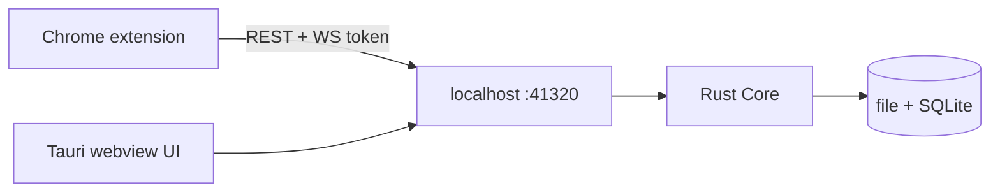

# Dash Download

English | [中文](#dash-download-中文)

A cross-platform download manager, rewritten from [Neat Download Manager](https://www.neatdownloadmanager.com/index.php/en/). HTTP/HTTPS only in v0.1. The engine is a resident Rust Core inside a Tauri desktop app; the Chrome extension is a thin client of the same localhost API.

Closing the window hides it to the tray. Downloads keep running.

## Status

v0.1 is usable on **macOS arm64**. Linux x86_64 and Windows x86_64 recipes exist in the justfile but are not yet proven on those hosts.

## Features

- Multi-connection segmented download (`Range`), fallback to a single stream when the server refuses Range
- Pause / resume / redownload; URL and request headers are kept with the Task forever
- Crash-safe SQLite checkpoints; preallocated single-file `pwrite` (temp name `*.ddown`, rename on complete)
- Queue with a fixed concurrency of 3 tasks, 8 connections each (settings UI comes later)
- NDM-style table UI, native title bar, tray
- Chrome MV3 Takeover: intercept browser downloads and forward cookies / referer / user-agent

Not in v0.1: dynamic re-segmentation, rate limit, proxy, HLS/DASH/FTP, video sniffing.

## Architecture



| Path | Role |
|---|---|
| `crates/core` | Engine library: probe, segments, queue, store |
| `crates/app` | Tauri shell + axum API |
| `ui` | Preact + Vite UI |
| `extension` | Chrome MV3 unpacked extension |

Decisions live in `docs/adr/`. Domain terms live in `CONTEXT.md`. Plan lives in `ROADMAP.md`.

## Requirements

- Rust (edition 2021), `just`, Node.js, `pnpm`
- macOS: Xcode CLT. Linux/Windows: platform webview + linker; cross-compiling the Tauri shell from macOS usually fails

## Build and run

```bash
just setup          # pnpm deps + rustup targets
just dev            # vite + tauri, hot reload
just macos-arm      # aarch64-apple-darwin .app
just linux-x86      # x86_64-unknown-linux-gnu deb
just windows-x86    # x86_64-pc-windows-msvc nsis
just open           # open the last macOS .app
```

Default download directory is the user Downloads folder. Core state and the pairing token:

- macOS: `~/Library/Application Support/dash-download/`

API binds `127.0.0.1:41320`. Header: `x-dd-token`. WS: `/api/ws?token=...`.

## Chrome extension

1. Start the app
2. Chrome → `chrome://extensions` → Developer mode → Load unpacked → select `extension/`
3. Copy the token from app Settings into the extension popup

If the app is not running, the browser download is left untouched. Right-click a link for a manual send. Files under 1 MB or `text/html` are not taken over.

## License

[Apache License 2.0](LICENSE). Copyright 2026 ray.

---

# Dash Download (中文)

[English](#dash-download) | 中文

跨平台下载管理器, 重写 [Neat Download Manager](https://www.neatdownloadmanager.com/index.php/en/). v0.1 只做 HTTP/HTTPS. 引擎是 Tauri 桌面 app 内的常驻 Rust Core; Chrome 扩展是同一套 localhost API 的薄客户端.

关窗缩到托盘, 下载不中断.

## 状态

v0.1 在 **macOS arm64** 可用. `justfile` 已挂 Linux x86_64 / Windows x86_64, 尚未在对应主机上跑通.

## 能力

- 多连接分段 (`Range`), 服务器拒绝 Range 时降级单连接
- 暂停 / 续传 / 重新下载; URL 与请求头随 Task 永久保留
- SQLite checkpoint 可从崩溃恢复; 预分配单文件 `pwrite` (下载中 `*.ddown`, 完成后 rename)
- 队列: 同时 3 个 Task, 每 Task 8 连接 (设置页后置)
- NDM 式表格 UI, 原生标题栏, 托盘
- Chrome MV3 Takeover: 接管浏览器下载并带走 cookies / referer / user-agent

v0.1 不做: 动态再切段, 限速, 代理, HLS/DASH/FTP, 视频嗅探.

## 架构

见上方 mermaid. 目录分工相同. 决策在 `docs/adr/`, 术语在 `CONTEXT.md`, 计划在 `ROADMAP.md`.

## 依赖

- Rust (2021 edition), `just`, Node.js, `pnpm`
- macOS 需要 Xcode CLT. Linux/Windows 需要各平台 webview 与 linker; 从 Mac 交叉编 Tauri 壳通常会失败

## 编译与运行

```bash
just setup
just dev
just macos-arm
just linux-x86
just windows-x86
just open
```

默认下到用户 Downloads. 状态与配对 token 在 `~/Library/Application Support/dash-download/`. API: `127.0.0.1:41320`, header `x-dd-token`.

## Chrome 扩展

1. 先启动 app
2. Chrome `chrome://extensions` 开发者模式 → 加载已解压的扩展 → 选 `extension/`
3. 从 app 设置复制 token 粘贴到扩展 popup

app 未运行时不接管, 浏览器原下载继续. 可右键链接手动发送. 小于 1MB 或 `text/html` 不接管.

## 许可证

[Apache License 2.0](LICENSE). Copyright 2026 ray.
