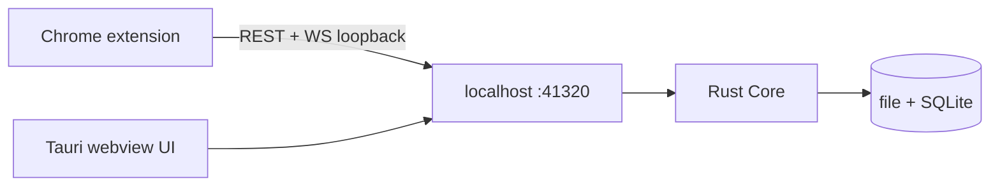

# Dash Download

English | [中文](#dash-download-中文)

A cross-platform download manager, rewritten from [Neat Download Manager](https://www.neatdownloadmanager.com/index.php/en/). HTTP/HTTPS and BitTorrent (magnet / `.torrent`). The engine is a resident Rust Core inside a Tauri desktop app; the Chrome extension is a thin client of the same localhost API.

Closing the window hides it to the tray. Downloads keep running.


## Quick start

You need **two pieces** from the same [GitHub Release](https://github.com/rayz2099/dash-download/releases/latest):

| Piece | Asset name |
|---|---|
| Desktop app | `DashDownload-*-mac-arm64.dmg` (or `Dash.Download_*_aarch64.dmg`) |
| Chrome extension | `dash-download-chrome-v*.zip` (or `DashDownload-*-chrome.zip`) |

Install the **app first** and launch it once. That registers the native host so Chrome can wake Dash Download when it is not running. Then load the extension.

v1 is dogfooded on **macOS arm64**. Linux x86_64 and Windows x86_64 packages are produced by CI when those jobs succeed.

### 1. Install Dash Download

**macOS arm64**

1. Open the `.dmg` and drag `Dash Download.app` into Applications.
2. The build is not notarized. In Finder, **right-click** the app → **Open** → confirm Gatekeeper. A double-click is often blocked.
3. If macOS still refuses: System Settings → Privacy & Security → **Open Anyway**.
4. Launch Dash Download. You should see the task table. Closing the window leaves it in the menu-bar tray.

Login autostart is on by default. Default save location is the user Downloads folder. Change it later in the app: Settings → General.

**Linux x86_64** (when the Release has a `.deb`):

```bash
sudo dpkg -i DashDownload-*-linux-x64.deb
# if webkit deps are missing:
sudo apt-get install -f
```

**Windows x86_64** (when the Release has a setup `.exe`): run the NSIS installer.

### 2. Install the Chrome extension

The extension is not on the Chrome Web Store. Load it unpacked. Chromium-based browsers work the same way (Chrome, Edge, Brave, Arc, Vivaldi).

1. Download `dash-download-chrome-v*.zip` from the **same** Release as the app. Unzip it. You should get a folder named `dash-download-chrome` that contains `manifest.json`.
2. Open `chrome://extensions` (Edge: `edge://extensions`).
3. Turn on **Developer mode** (top-right).
4. Click **Load unpacked** and select that `dash-download-chrome` folder — the one with `manifest.json`, not the zip and not a parent directory.
5. Pin it: puzzle icon in the toolbar → pin Dash Download.

From a git checkout you can skip the zip and load `extension/` directly.

### 3. Confirm they talk to each other

Click the toolbar icon. The popup should show a **green dot** and `已连接 vX.Y.Z`.

If it says `app 未运行`:

1. Start Dash Download from Applications / the tray and wait a few seconds.
2. Click the popup again. First launch of the app is what writes the native host; without that, Chrome cannot wake it.
3. After an app or extension update, go back to `chrome://extensions` and hit **Reload** on Dash Download.

### 4. First download

With takeover **on** (the default), click a normal file link in the browser. Chrome's download is aborted; the task appears in Dash Download, including cookies / referer / user-agent.

Other ways to send a file:

- Right-click a link → **使用 Dash Download 下载**. This bypasses size / type / deny-list filters.
- In the app, **新建下载** and paste a URL or magnet, or pick a `.torrent`.

The popup also has:

- **接管浏览器下载** — master switch
- **最小体积 (MB)** — known sizes below this stay in Chrome (default 1; `0` disables the filter)
- **域名黑名单** — one host per line; matches the host and its subdomains

Left for Chrome on purpose: `text/html`, files under the size threshold, deny-listed hosts, and `chrome:` / `edge:` internal URLs. Blob / data URLs up to 24 MB can be taken over; larger ones stay in the browser.

### Everyday use

- Pause / resume / redownload from the task table or the row context menu. URL and request headers stay with the Task.
- Settings → General: default folder, concurrent tasks, connections per task, launch at login.
- Settings → P2P: off by default. Turn it on for magnet DHT fallback, torrent download, and seeding.
- Settings → Proxy: direct / env (`HTTP_PROXY`) / HTTP / SOCKS5. Probe before you rely on it.
- Settings → Update: the app checks GitHub Releases. The **extension is not auto-updated** — download the new zip, overwrite the folder, Reload unpacked.
- Closing the window does not stop downloads. Quit from the tray when you actually want the engine gone.

### Troubleshooting

| Symptom | Fix |
|---|---|
| macOS: "app is damaged" / cannot be opened | Right-click → Open, or Privacy & Security → Open Anyway |
| Popup: `app 未运行` | Launch the app once so native host is registered; then retry |
| Chrome: "manifest file is missing" | Select the inner `dash-download-chrome` folder, not the zip |
| Browser still saves the file itself | Check takeover is on; file may be HTML, below 1 MB, or on the deny list. Use the context menu to force it |
| Takeover stopped after an update | `chrome://extensions` → Reload. App and extension versions should match |
| Download in app is empty / 403 | The site needs cookies. Use takeover or the context menu from the logged-in tab, not a pasted URL |

## Features

- Multi-connection segmented download (`Range`); single stream when the server refuses Range
- Pause / resume / redownload; URL and request headers are kept with the Task forever
- Crash-safe SQLite checkpoints; preallocated single-file `pwrite` (temp name `*.ddown`, rename on complete)
- Queue with a concurrency cap (default 3 tasks, 8 connections each); both are in Settings
- NDM-style table UI, native title bar, tray
- Chrome MV3 Takeover: intercept browser downloads and forward cookies / referer / user-agent; magnet clicks and `.torrent` files go to Core
- BitTorrent: magnet / `.torrent`, file selection, optional public trackers, seeding

Not in v1: dynamic re-segmentation, rate limit, HLS/DASH/FTP, video sniffing.

## Architecture



| Path | Role |
|---|---|
| `crates/core` | Engine library: probe, segments, queue, store |
| `crates/app` | Tauri shell + axum API |
| `ui` | Preact + Vite UI |
| `extension` | Chrome MV3 unpacked extension |

API binds `127.0.0.1:41320`. No pairing token. Browser clients send `x-dd-client`; CORS allowlists extension / Tauri / vite origins.

Core state:

- macOS: `~/Library/Application Support/dash-download/`
- Linux: `~/.config/dash-download/`
- Windows: `%APPDATA%\dash-download\`

Decisions live in `docs/adr/`. Domain terms live in `CONTEXT.md`. Plan lives in `ROADMAP.md`.

To ship auto-update artifacts, set repo secret `TAURI_SIGNING_PRIVATE_KEY` to the contents of the local gitignored `.secrets/updater.key`.

## Release (GitHub Actions)

Pushing a tag that starts with `v` builds the four packages and publishes one GitHub Release:

```bash
# bump versions first: Cargo.toml workspace, crates/app/tauri.conf.json, extension/manifest.json
git tag v1.0.0
git push origin v1.0.0
```

`v1.0` also matches. Workflow: `.github/workflows/release.yml`.

| Job | Asset |
|---|---|
| macOS arm64 | `.app` + `.dmg` |
| Linux x86_64 | `.deb` + AppImage (updater) |
| Windows x86_64 | NSIS `.exe` |
| Chrome MV3 | `dash-download-chrome-<tag>.zip` |

After a successful publish, older GitHub Releases **and their tags** are deleted, keeping only the newest 3.

Repo setting required once: Settings → Actions → General → Workflow permissions → Read and write.

## Requirements (from source)

- Rust (edition 2021), `just`, Node.js, `pnpm`
- macOS: Xcode CLT. Linux/Windows: platform webview + linker; cross-compiling the Tauri shell from macOS usually fails

## Build and run

```bash
just setup          # pnpm deps + rustup targets
just dev            # vite + tauri, hot reload
just macos-arm      # aarch64-apple-darwin .app
just linux-x86      # x86_64-unknown-linux-gnu deb
just windows-x86    # x86_64-pc-windows-msvc nsis
just open           # open the last macOS .app
```

## License

[Apache License 2.0](LICENSE). Copyright 2026 ray.

---

# Dash Download (中文)

[English](#dash-download) | 中文

跨平台下载管理器, 重写 [Neat Download Manager](https://www.neatdownloadmanager.com/index.php/en/). HTTP/HTTPS 与 BitTorrent (磁力 / `.torrent`). 引擎是 Tauri 桌面 app 内的常驻 Rust Core; Chrome 扩展是同一套 localhost API 的薄客户端.

关窗缩到托盘, 下载不中断.


## 快速上手

从同一个 [GitHub Release](https://github.com/rayz2099/dash-download/releases/latest) 拿 **两件套**:

| 部件 | 资产名 |
|---|---|
| 桌面应用 | `DashDownload-*-mac-arm64.dmg` (或 `Dash.Download_*_aarch64.dmg`) |
| Chrome 扩展 | `dash-download-chrome-v*.zip` (或 `DashDownload-*-chrome.zip`) |

**先装桌面应用并启动一次**, 再加载扩展. 第一次启动会注册 native host, 之后 Chrome 才能在 app 没开时把它拉起来.

v1 在 **macOS arm64** 日常可用. Linux x86_64 / Windows x86_64 由 CI 打包, 对应 job 成功时 Release 里才会有安装包.

### 1. 安装 Dash Download

**macOS arm64**

1. 打开 `.dmg`, 把 `Dash Download.app` 拖进 Applications.
2. 未公证. 在 Finder 里 **右键** app → **打开** → 确认 Gatekeeper. 双击经常被拦.
3. 仍被拦: 系统设置 → 隐私与安全性 → **仍要打开**.
4. 启动 Dash Download, 应看到任务表. 关窗后还在菜单栏托盘里, 下载继续.

默认开机自启. 默认下到用户 Downloads, 之后可在应用内 设置 → 通用 改目录.

**Linux x86_64** (Release 有 `.deb` 时):

```bash
sudo dpkg -i DashDownload-*-linux-x64.deb
# 缺 webkit 依赖再:
sudo apt-get install -f
```

**Windows x86_64** (Release 有 setup `.exe` 时): 跑 NSIS 安装程序.

### 2. 安装 Chrome 扩展

尚未上架 Chrome 商店, 用已解压方式加载. Chromium 内核浏览器同样适用 (Chrome / Edge / Brave / Arc / Vivaldi).

1. 从 **同一个** Release 下载 `dash-download-chrome-v*.zip`, 解压. 得到含 `manifest.json` 的 `dash-download-chrome` 目录.
2. 打开 `chrome://extensions` (Edge 是 `edge://extensions`).
3. 右上角打开 **开发者模式**.
4. **加载已解压的扩展**, 选那个带 `manifest.json` 的 `dash-download-chrome` 目录. 不要选 zip, 也不要选上一层.
5. 钉到工具栏: 拼图图标 → 钉住 Dash Download.

从源码目录开发时可以直接加载 `extension/`.

### 3. 确认两者已连通

点工具栏图标. popup 应是 **绿点** + `已连接 vX.Y.Z`.

若显示 `app 未运行`:

1. 从 Applications / 托盘启动 Dash Download, 等几秒再点 popup.
2. 必须先成功启动过一次 app, native host 才会写进浏览器目录; 否则扩展拉不起来.
3. app 或扩展更新后, 到 `chrome://extensions` 对 Dash Download 点 **重新加载**.

### 4. 第一次下载

接管默认是开的. 在网页上点普通文件链接, Chrome 原下载会被 abort, 任务出现在 Dash Download 里, 并带走 cookies / referer / user-agent.

另外两种入口:

- 链接上右键 → **使用 Dash Download 下载**. 绕过体积 / 类型 / 黑名单过滤.
- 应用内 **新建下载**, 粘贴 URL 或磁力, 或选 `.torrent`.

popup 里还能调:

- **接管浏览器下载** — 总开关
- **最小体积 (MB)** — 已知体积低于此值留给 Chrome (默认 1; `0` 表示不按体积过滤)
- **域名黑名单** — 一行一个 host, 匹配自身和子域

故意不接管: `text/html`, 低于体积阈值, 黑名单域名, 以及 `chrome:` / `edge:` 内部地址. blob / data URL 最大 24 MB, 再大留给浏览器.

### 日常使用

- 任务表或行右键: 暂停 / 继续 / 重新下载. URL 与请求头随 Task 永久保留.
- 设置 → 通用: 默认目录, 同时下载数, 每任务连接数, 开机自启.
- 设置 → P2P: 默认关闭. 磁力 DHT 回退, 种子下载和做种需要打开.
- 设置 → 代理: 直连 / 跟随环境变量 (`HTTP_PROXY`) / HTTP / SOCKS5. 先探测再当真.
- 设置 → 更新: app 会查 GitHub Release. **扩展不会自动更新** — 下新 zip, 覆盖原目录, 再 Reload.
- 关窗不停下载. 真要停引擎, 从托盘退出.

### 排障

| 现象 | 处理 |
|---|---|
| macOS 提示已损坏 / 无法打开 | 右键 → 打开, 或 隐私与安全性 → 仍要打开 |
| popup 显示 `app 未运行` | 先启动一次 app 完成 native host 注册, 再试 |
| Chrome 报找不到 manifest | 选内层 `dash-download-chrome` 目录, 不要选 zip |
| 文件仍被浏览器自己存了 | 看接管开关是否开; 可能是 HTML / 小于 1 MB / 黑名单. 右键菜单可强制发送 |
| 更新后不再接管 | `chrome://extensions` → 重新加载. app 与扩展版本应对齐 |
| app 里任务 403 / 空文件 | 站点要 cookies. 从已登录的页面走接管或右键发送, 不要只粘贴 URL |

## 能力

- 多连接分段 (`Range`), 服务器拒绝 Range 时降级单连接
- 暂停 / 续传 / 重新下载; URL 与请求头随 Task 永久保留
- SQLite checkpoint 可从崩溃恢复; 预分配单文件 `pwrite` (下载中 `*.ddown`, 完成后 rename)
- 队列并发可配 (默认 3 个 Task, 每 Task 8 连接), 在设置页
- NDM 式表格 UI, 原生标题栏, 托盘
- Chrome MV3 Takeover: 接管浏览器下载并带走 cookies / referer / user-agent; 磁力点击和 `.torrent` 交给 Core
- BitTorrent: 磁力 / `.torrent`, 选文件, 可选公共 tracker, 做种

v1 不做: 动态再切段, 限速, HLS/DASH/FTP, 视频嗅探.

## 架构

见上方 mermaid. 目录分工相同. API: `127.0.0.1:41320`, 无配对 token.

状态目录:

- macOS: `~/Library/Application Support/dash-download/`
- Linux: `~/.config/dash-download/`
- Windows: `%APPDATA%\dash-download\`

决策在 `docs/adr/`, 术语在 `CONTEXT.md`, 计划在 `ROADMAP.md`.

发自动更新包需要把本机 gitignore 的 `.secrets/updater.key` 全文配到仓库 secret `TAURI_SIGNING_PRIVATE_KEY`.

## 发版 (GitHub Actions)

推一个以 `v` 开头的 tag 就会分别打包并发布一个 GitHub Release:

```bash
# 先改版本号: Cargo.toml workspace, crates/app/tauri.conf.json, extension/manifest.json
git tag v1.0.0
git push origin v1.0.0
```

`v1.0` 同样匹配. 工作流: `.github/workflows/release.yml`.

| Job | 资产 |
|---|---|
| macOS arm64 | `.app` + `.dmg` |
| Linux x86_64 | `.deb` + AppImage (updater) |
| Windows x86_64 | NSIS `.exe` |
| Chrome MV3 | `dash-download-chrome-<tag>.zip` |

发布成功后删除更旧的 GitHub Release **以及对应 tag**, 只留最新 3 个.

仓库需要一次性打开: Settings → Actions → General → Workflow permissions → Read and write.

## 依赖 (源码)

- Rust (2021 edition), `just`, Node.js, `pnpm`
- macOS 需要 Xcode CLT. Linux/Windows 需要各平台 webview 与 linker; 从 Mac 交叉编 Tauri 壳通常会失败

## 编译与运行

```bash
just setup
just dev
just macos-arm
just linux-x86
just windows-x86
just open
```

## 许可证

[Apache License 2.0](LICENSE). Copyright 2026 ray.
