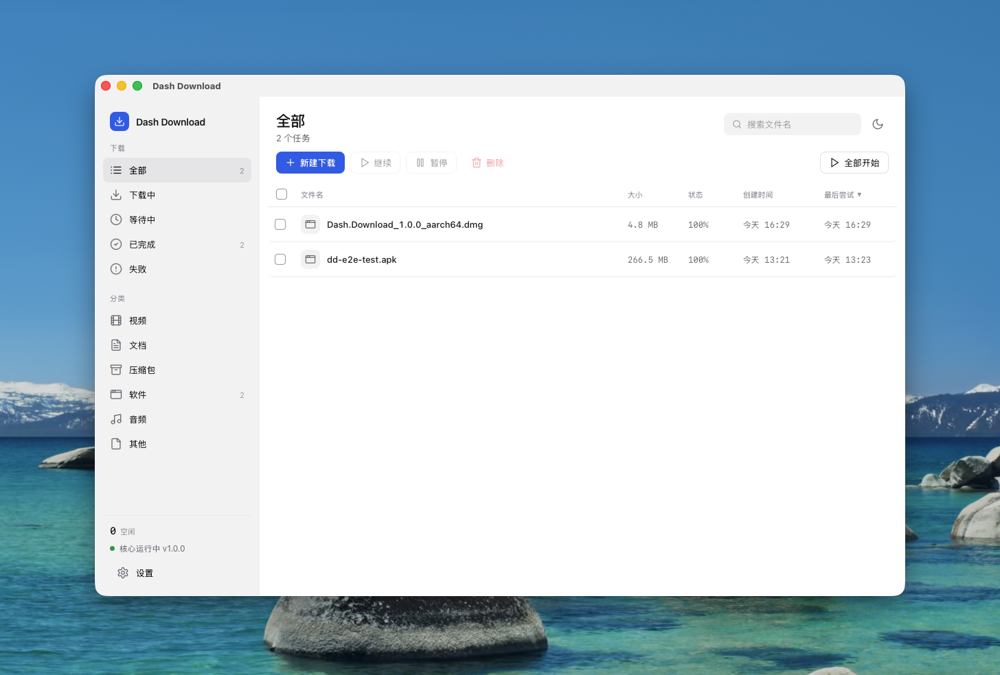
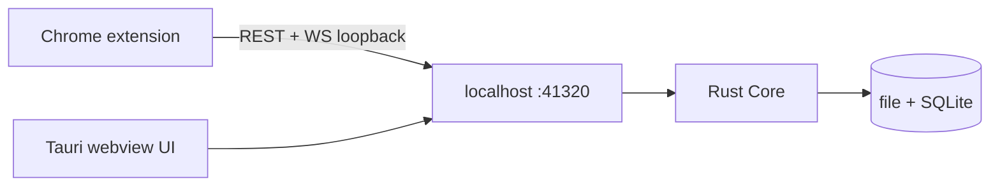

# Dash Download

English | [中文](#dash-download-中文)

A cross-platform download manager, rewritten from [Neat Download Manager](https://www.neatdownloadmanager.com/index.php/en/). HTTP/HTTPS only in v0.1. The engine is a resident Rust Core inside a Tauri desktop app; the Chrome extension is a thin client of the same localhost API.

Closing the window hides it to the tray. Downloads keep running.



## Status

v0.1 is usable on **macOS arm64**. Linux x86_64 and Windows x86_64 are built by GitHub Actions on tag; those hosts are not yet dogfooded.

## Features

- Multi-connection segmented download (`Range`), fallback to a single stream when the server refuses Range
- Pause / resume / redownload; URL and request headers are kept with the Task forever
- Crash-safe SQLite checkpoints; preallocated single-file `pwrite` (temp name `*.ddown`, rename on complete)
- Queue with a fixed concurrency of 3 tasks, 8 connections each (settings UI comes later)
- NDM-style table UI, native title bar, tray
- Chrome MV3 Takeover: intercept browser downloads and forward cookies / referer / user-agent

Not in v0.1: dynamic re-segmentation, rate limit, proxy, HLS/DASH/FTP, video sniffing.

## Architecture



| Path | Role |
|---|---|
| `crates/core` | Engine library: probe, segments, queue, store |
| `crates/app` | Tauri shell + axum API |
| `ui` | Preact + Vite UI |
| `extension` | Chrome MV3 unpacked extension |

Decisions live in `docs/adr/`. Domain terms live in `CONTEXT.md`. Plan lives in `ROADMAP.md`.

## Install

Get a tagged build from [GitHub Releases](https://github.com/rayz2099/dash-download/releases/latest). App packages and the Chrome zip are **separate assets**. Only the latest 3 releases are kept.

### App

| OS | Asset | How |
|---|---|---|
| macOS arm64 | `*.dmg` (or `.app`) | Open the dmg, drag `Dash Download.app` to Applications. Not notarized: Finder → right-click the app → Open → confirm Gatekeeper |
| Linux x86_64 | `*.deb` | `sudo dpkg -i dash-download_*.deb` then `sudo apt-get install -f` if webkit deps are missing |
| Windows x86_64 | NSIS `*.exe` | Run the installer |

Start the app first. Closing the window keeps it in the tray. Login autostart is on by default so Chrome can wake the app via a launch-only native host.

To ship auto-update artifacts, set repo secret `TAURI_SIGNING_PRIVATE_KEY` to the contents of the local gitignored `.secrets/updater.key`.

Default download directory is the user Downloads folder. Core state:

- macOS: `~/Library/Application Support/dash-download/`
- Linux: `~/.config/dash-download/`
- Windows: `%APPDATA%\dash-download\`

API binds `127.0.0.1:41320`. No pairing token. Browser clients send `x-dd-client`; CORS allowlists extension / Tauri / vite origins.

### Chrome extension

The plugin is not on the Chrome Web Store yet. Load it unpacked.

1. Start the app
2. Download `dash-download-chrome-v*.zip` from the same Release, unzip it
3. Chrome → `chrome://extensions` → Developer mode → Load unpacked → select the `dash-download-chrome` folder (the one that contains `manifest.json`)
4. Popup only has takeover toggle + health. Reload the extension after updates

If the app is not running, the extension wakes it via native host and then takes over. If wake fails, the browser download is left untouched. Right-click a link to send manually (bypasses filters). Files under the size threshold (default 1 MB), `text/html`, or hosts on the popup deny-list are not taken over.

From a git checkout you can skip the zip and load `extension/` directly.

## Release (GitHub Actions)

Pushing a tag that starts with `v` builds the four packages and publishes one GitHub Release:

```bash
# bump versions first: Cargo.toml workspace, crates/app/tauri.conf.json, extension/manifest.json
git tag v1.0.0
git push origin v1.0.0
```

`v1.0` also matches. Workflow: `.github/workflows/release.yml`.

| Job | Asset |
|---|---|
| macOS arm64 | `.app` + `.dmg` |
| Linux x86_64 | `.deb` + AppImage (updater) |
| Windows x86_64 | NSIS `.exe` |
| Chrome MV3 | `dash-download-chrome-<tag>.zip` |

After a successful publish, older GitHub Releases **and their tags** are deleted, keeping only the newest 3.

Repo setting required once: Settings → Actions → General → Workflow permissions → Read and write.

## Requirements (from source)

- Rust (edition 2021), `just`, Node.js, `pnpm`
- macOS: Xcode CLT. Linux/Windows: platform webview + linker; cross-compiling the Tauri shell from macOS usually fails

## Build and run

```bash
just setup          # pnpm deps + rustup targets
just dev            # vite + tauri, hot reload
just macos-arm      # aarch64-apple-darwin .app
just linux-x86      # x86_64-unknown-linux-gnu deb
just windows-x86    # x86_64-pc-windows-msvc nsis
just open           # open the last macOS .app
```

## License

[Apache License 2.0](LICENSE). Copyright 2026 ray.

---

# Dash Download (中文)

[English](#dash-download) | 中文

跨平台下载管理器, 重写 [Neat Download Manager](https://www.neatdownloadmanager.com/index.php/en/). v0.1 只做 HTTP/HTTPS. 引擎是 Tauri 桌面 app 内的常驻 Rust Core; Chrome 扩展是同一套 localhost API 的薄客户端.

关窗缩到托盘, 下载不中断.


## 状态

v0.1 在 **macOS arm64** 可用. Linux x86_64 / Windows x86_64 由 tag 触发的 GitHub Actions 打包, 尚未在对应主机上日常使用.

## 能力

- 多连接分段 (`Range`), 服务器拒绝 Range 时降级单连接
- 暂停 / 续传 / 重新下载; URL 与请求头随 Task 永久保留
- SQLite checkpoint 可从崩溃恢复; 预分配单文件 `pwrite` (下载中 `*.ddown`, 完成后 rename)
- 队列: 同时 3 个 Task, 每 Task 8 连接 (设置页后置)
- NDM 式表格 UI, 原生标题栏, 托盘
- Chrome MV3 Takeover: 接管浏览器下载并带走 cookies / referer / user-agent

v0.1 不做: 动态再切段, 限速, 代理, HLS/DASH/FTP, 视频嗅探.

## 架构

见上方 mermaid. 目录分工相同. 决策在 `docs/adr/`, 术语在 `CONTEXT.md`, 计划在 `ROADMAP.md`.

## 安装

从 [GitHub Releases](https://github.com/rayz2099/dash-download/releases/latest) 拿带 tag 的构建. 桌面安装包和 Chrome zip 是**分开的资产**. 只保留最新 3 个 Release.

### App

| 系统 | 资产 | 安装 |
|---|---|---|
| macOS arm64 | `*.dmg` (或 `.app`) | 打开 dmg, 把 `Dash Download.app` 拖进 Applications. 未公证: Finder 右键 app → 打开 → 确认 Gatekeeper |
| Linux x86_64 | `*.deb` | `sudo dpkg -i dash-download_*.deb`, 缺 webkit 依赖再 `sudo apt-get install -f` |
| Windows x86_64 | NSIS `*.exe` | 跑安装程序 |

先启动 app, 关窗后仍在托盘. 默认开机自启. Chrome 扩展在 app 没跑时走 native host 拉起再接管; 拉不起才把下载留在浏览器.

发自动更新包需要把本机 gitignore 的 `.secrets/updater.key` 全文配到仓库 secret `TAURI_SIGNING_PRIVATE_KEY`.

默认下到用户 Downloads. 状态目录:

- macOS: `~/Library/Application Support/dash-download/`
- Linux: `~/.config/dash-download/`
- Windows: `%APPDATA%\dash-download\`

API: `127.0.0.1:41320`, 无配对 token.

### Chrome 扩展

尚未上架 Chrome 商店, 用已解压方式加载.

1. 先启动 app
2. 同一 Release 下载 `dash-download-chrome-v*.zip`, 解压
3. Chrome `chrome://extensions` 开发者模式 → 加载已解压的扩展 → 选带 `manifest.json` 的 `dash-download-chrome` 目录
4. popup 只有接管开关和健康检查. 更新后需要重新加载扩展

app 未运行时走 native host 拉起再接管; 拉不起则不 abort, 浏览器原下载继续. 右键链接手动发送不受过滤. 低于体积阈值 (默认 1MB), `text/html`, 或 popup 黑名单域名不接管.

从源码目录开发时可以直接加载 `extension/`.

## 发版 (GitHub Actions)

推一个以 `v` 开头的 tag 就会分别打包并发布一个 GitHub Release:

```bash
# 先改版本号: Cargo.toml workspace, crates/app/tauri.conf.json, extension/manifest.json
git tag v1.0.0
git push origin v1.0.0
```

`v1.0` 同样匹配. 工作流: `.github/workflows/release.yml`.

| Job | 资产 |
|---|---|
| macOS arm64 | `.app` + `.dmg` |
| Linux x86_64 | `.deb` + AppImage (updater) |
| Windows x86_64 | NSIS `.exe` |
| Chrome MV3 | `dash-download-chrome-<tag>.zip` |

发布成功后删除更旧的 GitHub Release **以及对应 tag**, 只留最新 3 个.

仓库需要一次性打开: Settings → Actions → General → Workflow permissions → Read and write.

## 依赖 (源码)

- Rust (2021 edition), `just`, Node.js, `pnpm`
- macOS 需要 Xcode CLT. Linux/Windows 需要各平台 webview 与 linker; 从 Mac 交叉编 Tauri 壳通常会失败

## 编译与运行

```bash
just setup
just dev
just macos-arm
just linux-x86
just windows-x86
just open
```

## 许可证

[Apache License 2.0](LICENSE). Copyright 2026 ray.
